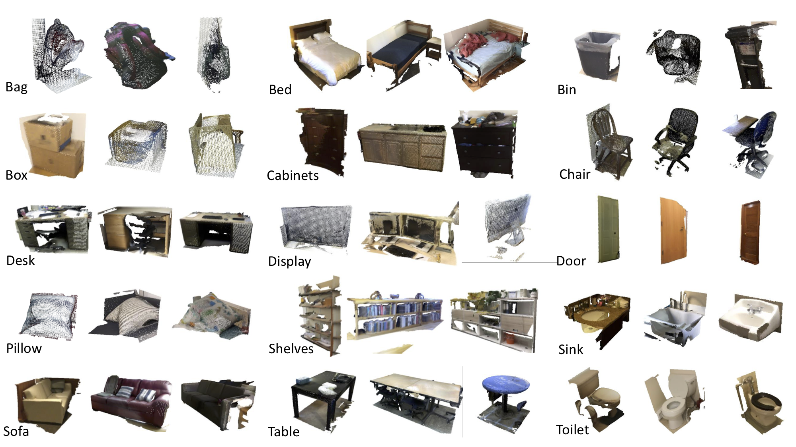

# Revisiting Point Cloud Classification: A New Benchmark Dataset and Classification Model on Real-World Data
**[Revisiting Point Cloud Classification: A New Benchmark Dataset and Classification Model on Real-World Data](https://hkust-vgd.github.io/scanobjectnn/)** 

Mikaela Angelina Uy, Quang-Hieu Pham, Binh-Son Hua, Duc Thanh Nguyen and Sai-Kit Yeung

ICCV 2019 Oral Presentation



## Introduction
This work revisits the problem of point cloud classification but on real world scans as opposed to synthetic models such as ModelNet40 that were studied in other recent works. We introduce **ScanObjectNN**, a new benchmark dataset containing ~15,000 object that are categorized into 15 categories with 2902 unique object instances. The raw objects are represented by a list of points with global and local coordinates, normals, colors attributes and semantic labels. We also provide part annotations, which to the best of our knowledge is the first on real-world data. From our comprehensive benchmark, we show that our dataset poses great challenges to existing point cloud classification techniques as objects from real-world scans are often cluttered with background and/or are partial due to occlusions. Our project page can be found [here](https://hkust-vgd.github.io/scanobjectnn/), and the arXiv version of our paper can be found [here](https://arxiv.org/abs/1908.04616).
```
@inproceedings{uy-scanobjectnn-iccv19,
      title = {Revisiting Point Cloud Classification: A New Benchmark Dataset and Classification Model on Real-World Data},
      author = {Mikaela Angelina Uy and Quang-Hieu Pham and Binh-Son Hua and Duc Thanh Nguyen and Sai-Kit Yeung},
      booktitle = {International Conference on Computer Vision (ICCV)},
      year = {2019}
  }
```

## ScanObjectNN Dataset
<!--Our ScanObjectNN Dataset can be downloaded from here: [HKUST OneDrive](https://gohkust-my.sharepoint.com/:f:/g/personal/saikit_ust_hk/EqRFLP5XEihCt_PFIHyPNO8BsKb7r8S5V5ELaCqk7UdDTQ?e=FX2OPF) or here: [SUTD server](http://103.24.77.34:8080/scanobjectnn/). --> We provide different variants of our scan dataset namely: OBJ_BG, PB_T25, PB_T25_R, PB_T50_R and PB_T50_RS as described in our paper. We released both the processed .h5 files and the raw .bin objects as described below.

### h5 files
* Download the **h5_files.zipped** to obtained all the h5 files. Main split was used for the experiments in the [main paper](https://arxiv.org/pdf/1908.04616.pdf), while splits 1-4 are the additional training/test splits reported in our [supplementary material](https://hkust-vgd.github.io/scanobjectnn/assets/iccv19_supp.pdf).
* The pre-processed h5 files can be directly used by deep learning frameworks, containing fields: 
   1. **data**: Nx3 point cloud
   2. **label**: class label
   3. **mask**: indicator whether each point is part of the object instance or the background.
* Each object contained 2048 points, where each point is represented by its x, y, z coordinates. 
* We first ensured that a data sample had at least 2048 object instance points (excluding the background) before 2048 points were randomly selected (including the background points) and included into the h5 file. For the \*_nobg h5 files, background points were first filtered out before the random selection. 
* Naming convention: Prefixes are *training_** and *test_** for training set and test set, respectively.
    * **OBJ_BG** / **OBJ_ONLY**: *\*objectdataset.h5*
    * **PB_T25**: *\*objectdataset_augmented25_norot.h5*
    * **PB_T25_R**: *\*objectdataset_augmented25rot.h5*
    * **PB_T50_R**: *\*objectdataset_augmentedrot.h5*
    * **PB_T50_RS**: *\*objectdataset_augmentedrot_scale75.h5*

### Raw files
We release all the raw object files of our ScanObjectNN dataset including all its variants.
* To obtain the files, download the zipped files of each corresponding variant. *object_dataset.zip* refers to the unaugmented variant (OBJ_BG).
* The list of all objects can be found at *training_data/object_labels.txt*. The format per line is (separated by '\t'):
    ```
    scene_folder    object_id    object_class    object_instance_label
    ```    
* The object .bin files are located at **[object_class]/[scene_folder]_[object_id].bin** in the dataset folder.
* Each .bin file is a series of *float32*. The first float represents the total number of points in the object instance. Then every succeeding set of 11 floats represent the attributes of each point. (ie if there are m points in the point cloud, then there are (11m + 1) floats in the .bin file)
* The attributes of each point are listed in the following order:
    ```
    x    y    z    nx    ny    nz    r    g    b    instance_label    semantic_label
    ```  
* We generated training and test split files located in *training_data/*, where 't' in each line of the text file indicates that the object is part of the test split.

Parts:
* V0 of the raw files with complete parts can be found in *object_dataset_complete_with_parts.zip*. Corresponding part labels can be found in the xml files located in *training_data/part_labels/*.

## Code
### Installation
Pre-requisites:
* python
* cuda
* tensorflow
* h5py
* scipy
* sklearn

This code has been tested with Python 3.5, Tensorflow 1.10 and CUDA 9.0 on Ubuntu 16.04. Please follow instructions in [PointNet++](https://github.com/charlesq34/pointnet2) to compile tf_ops in *pointnet2/* and *SpiderCNN/* subfolders.

### Usage
#### Training
To train the benchmark classification models, run the following commands:
```
cd [method_folder]
python train.py
```
To see optional arguments, run:
```
cd [method_folder]
python train.py -h
```
To train using our BGA models, run:
```
cd [dgcnn or pointnet2]
python train_seg.py
```
The model files are pointnet2_cls_bga.py and dgcnn_bga.py.

#### Evaluation
To evaluate the benchmark classification models, run the following commands:
```
cd [method_folder]
python evaluate_scenennobjects.py
```
To evaluate our BGA models, run:
```
cd [dgcnn or pointnet2]
python evaluate_seg_scenennobjects.py
```

#### Generalization of real vs synthetic
To evaluate on ScanObjectNN when trained on ModelNet, run:
```
cd [method_folder]
python evaluate_real_trained_on_synthetic.py
```
To evaluate on ModelNet when trained on ScanObjectNN, run:
```
cd [method_folder]
python evaluate_synthetic_trained_on_real.py
```
The class mapping file can be found at *mapping2.py*, details can be found in our supplementary material. Before running these experiments, please make sure you have the trained model files and a single .h5 file for the ModelNet data. The arguments need to be specified accordingly. 

## Pre-trained Models
Pre-trained models can be downloaded [here](https://drive.google.com/open?id=1somhNuzwEnJB7J6ESGuW_6ZryW8emW6u).

## FAQ
Some commonly asked questions regarding our dataset and project can be found [here](https://github.com/hkust-vgd/scanobjectnn/tree/master/training_data). For any other inquiries, feel free to post a github issue.

## References
Our released code heavily based on each methods original repositories as cited below:
* <a href="https://github.com/charlesq34/pointnet" target="_blank">PointNet: Deep Learning on Point Sets for 3D Classification and Segmentation</a> by Qi et al. (CVPR 2017).
* <a href="https://github.com/charlesq34/pointnet2" target="_black">PointNet++: Deep Hierarchical Feature Learning on Point Sets in a Metric Space</a> by Qi et al. (NIPS 2017).
* <a href="https://github.com/WangYueFt/dgcnn" target="_black"> Dynamic Graph CNN for Learning on Point Clouds</a> by Wang et al. (TOG 2019).
* <a href="https://github.com/yangyanli/PointCNN" target="_black">PointCNN: Convolution On X-Transformed Points</a> by Li et al. (NIPS 2018).
* <a href="https://github.com/xyf513/SpiderCNN" target="_black">SpiderCNN: Deep Learning on Point Sets with Parameterized Convolutional Filters</a> by Xu et al. (ECCV 2018).
* <a href="https://github.com/sitzikbs/3DmFV-Net" target="_black">3DmFV : Three-Dimensional Point Cloud Classification in Real-Time using Convolutional Neural Networks</a> by Ben-Shabat et al. (RA-L 2018).  

## License
This repository is released under MIT License (see LICENSE file for details).
